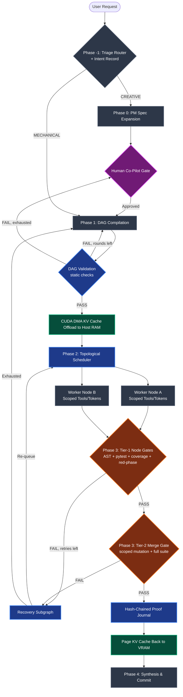

# Saddle Architecture

This document specifies Saddle: a local, high-performance, deterministic agentic coding harness — an enterprise-grade compiler pipeline designed for an NVIDIA RTX 3090 (24 GB VRAM) paired with 64 GB of system RAM.

Saddle's thesis: a non-deterministic local model becomes a dependable tool when planning is constrained, execution is parallel and proof-gated, and correctness is judged by machines, never by the model itself.

Hardware figures below are verified against the live stack (vLLM 0.28.0, Qwen3.8-27B hybrid config); the memory arithmetic is shown in §2 rather than asserted.

## 1. Core Architecture

### Design Decisions

> * **No LLM grading:** No model in the system evaluates code. Letting models grade code means sycophancy, non-determinism, and token waste exactly where absolute certainty is required, so the LLM has zero authority to grade its own work. The "did this satisfy the requirement?" function is preserved as machine-checked requirement IDs bound to every node gate (§3, Phase 3), not as model opinion.
> * **Single-drafter orchestration:** One Orchestrator call drafts the whole plan. Chaining separate drafting calls (orchestrator → architect → planner) causes "hallucination propagation," where constraints are silently dropped across model handoffs. The single-shot risk is contained by static DAG validation, bounded recompilation, and rolling-wave planning (§3, Phase 1) — one call drafts, but nothing executes until the draft passes machine checks.
> * **Ephemeral workers:** No persistent personas. Workers are stateless threads executing scoped tools on dependency-graph nodes and exiting; read-only reconnaissance runs on leaf nodes.

### Core Mechanisms

> * **Deterministic Environment Gates:** Code correctness is judged strictly by compilers, AST linters, test runners, and mutation testing thresholds — tiered so the per-node gate stays fast and the expensive mutation gate runs once, budgeted, at merge time (§3, Phase 3).
> * **Requirement-Bound Acceptance:** Every node declares the requirement IDs it satisfies, and its gate verifies each one with a test that fails pre-change and passes post-change. Passing tests alone never mark work done.
> * **Guided Decoding:** The DAG is emitted under a JSON-schema `structured_outputs` constraint over the whole completion; the diff is emitted under an EBNF grammar (`vllm.py:206`). No "structural tag snap after `<think>`" is built.
> * **Heterogeneous Test-Time Compute:** Dynamic allocation of reasoning budgets (Low vs. xhigh) and tool access per task node.
> * **KV Cache CPU Offloading:** Using system RAM as a parking lot for heavy orchestrator contexts via PCIe Direct Memory Access (DMA).
> * **Hash-Chained Proof Journal:** Every verified node emits a content-hashed proof record into an append-only journal. Downstream nodes cannot dispatch until all parent proofs exist — rework on unverified foundations is structurally impossible, not merely discouraged.

## 2. Hardware Footprint & Memory Management

The memory budget is governed by the physical constraints of a 24 GB GPU running a quantized 27B model (Qwen3.8-27B, W4A16).

| Component | VRAM Allocation | Host RAM Allocation | Function |
| :---- | :---- | :---- | :---- |
| **Model Weights** | ~14.0 GB | — | Pinned to GPU VRAM permanently (27B × 4-bit ≈ 13.5 GB + scales). |
| **Active KV Cache** | ~8.5 GB to 10.0 GB | — | Dynamically allocated via PagedAttention. |
| **Offloaded KV Cache** | — | ~20.0 GB reserved | Swapped out via CUDA DMA over PCIe 4.0. |
| **System Overhead** | ~1.5 GB | Remaining host RAM | OS, desktop environment, and disk cache. |

### Why the Numbers Work (verified, not asserted)

The model is a **hybrid**: 64 layers, but `full_attention` on every 4th layer only (`full_attention_interval = 4` in the live `config.json`), so **16 layers carry KV cache**. The other 48 are linear-attention layers with fixed-size recurrent state (tens of MB — negligible, not per-token).

- KV geometry: 4 KV heads × 256 head dim, KV dtype bfloat16 (2 bytes).
- Per-token KV = 2 × 16 layers × 4 heads × 256 dim × 2 B = **65,536 bytes (64 KiB)**.
- 175,000 tokens × 64 KiB ≈ **11.5 GB** (≈ the "~11.2 GB" budget — same computation within rounding).
- Flags verified in the installed vLLM 0.28.0 source (`config/cache.py`, `engine/arg_utils.py`): `--kv-offloading-size` provisions `size × 1 GB` of CPU buffer, and `--kv-offloading-backend native` selects vLLM native CPU offloading.
- Page-back time: ~11.5 GB over PCIe 4.0 x16 (~20–26 GB/s real DMA) lands at roughly 450–575 ms. Plausible as specified.
- **Pool overhead derate (measured):** block allocation and per-sequence state cost ~15–20% versus raw math (~70K tokens per 5.2 GiB pool in the live launch config). Budgets below use derated figures: **~140–150K usable tokens per full-VRAM window, ~28–30K per worker at 5-way fan-out** — not the raw 35K.

### Memory Swapping Lifecycle

> 1. **Orchestrator Execution:** The Orchestrator holds up to a 175,000-token context (~11.5 GB KV cache) during repository mapping and planning.
> 2. **The DMA Transfer:** Once the DAG is emitted, vLLM offloads the Orchestrator's KV cache to host system RAM via PCIe (--kv-offloading-backend native, --kv-offloading-size 20).
> 3. **Subagent Execution Pool:** The freed VRAM provides ~140,000–150,000 usable tokens for concurrent subagents after pool overhead. Under a 5-worker fan-out, each subagent receives a clean ~28,000–30,000-token ceiling without triggering VRAM swapping.
> 4. **Fan-In Paging:** Upon DAG completion, the Orchestrator's KV cache is paged back into VRAM in under ~600ms, resuming synthesis without prompt recomputation.

## 3. End-to-End Execution Pipeline



### Phase -1: The Triage Router

> *Status (2026-09-18): specified, not built — deferred.*

A low-latency, zero-reasoning classification pass using guided decoding to return an enum: [CREATIVE | MECHANICAL] — **plus a machine-checked intent record** (guided fields, not freeform):

> * **CREATIVE:** Open-ended requests, greenfield feature builds, or tasks requiring UX design.
> * **MECHANICAL:** Bug fixes, refactors, test repairs, and strictly bounded engineering tasks. Directly bypasses Phase 0.
> * **Intent record (both routes):** `problem_statement` (1–2 sentences), `acceptance_criteria` (2–5 checkable bullets), and `requirement_ids` (REQ-001, …). MECHANICAL skips the *human* gate but never the *intent record*: DAG validation (§Phase 1) rejects any plan in which a criterion maps to zero node gates. This closes the intent gap — mechanical work is still bound to a recorded, checkable intent.

### Phase 0: Product Manager Spec Expansion

*Applies to CREATIVE routes only.*

> * **Role:** An isolated, high-reasoning subsession acting as Lead Product Manager and UX Architect.
> * **Function:** Expands ambiguous prompts into explicit specifications (e.g., inferring camera controls, sound synchronization, and ambient features for a 3D scene). The spec MUST emit `requirement_ids` for every acceptance criterion; these IDs are what Phase 1 nodes bind to.
> * **Co-Pilot Gate:** Execution pauses. The user reviews, edits, or approves the generated Markdown spec before any code architecture is drafted.

### Phase 1: Orchestrator DAG Compilation

> * **Role:** Operates in a fresh session containing only the approved specification (or the Phase -1 intent record) and a compact repo map.
> * **Reasoning & Guided Decoding:** The 27B model runs at xhigh reasoning, generating freeform chain-of-thought within <think> tags.
> * **Guided Decoding:** The DAG is emitted under a JSON-schema `structured_outputs` constraint over the whole completion; the diff is emitted under an EBNF grammar (`vllm.py:206`). No "structural tag snap after `<think>`" is built.

> *Status (2026-09-18): structural-tag emission is specified, not built; see D14.*

```json
{
  "id": "write_wave_shaders",
  "kind": "impl",
  "dependencies": ["init_graphics_engine"],
  "task_prompt": "Implement Gerstner wave mathematics in a Three.js ShaderMaterial.",
  "requirements": [
    {"id": "REQ-014", "statement": "Wave displacement follows the Gerstner model.",
     "accepts": ["steepness=0.5"], "rejects": ["steepness=1.5"]},
    {"id": "REQ-015", "statement": "The shader compiles under the project's Three.js version.",
     "accepts": ["three@0.160.0"], "rejects": ["three@0.16.0"]}
  ],
  "execution_constraints": {
    "reasoning_budget": "xhigh",
    "allowed_tools": ["read_file", "write_file", "run_tests", "lint"],
    "max_context_tokens": 30000
  },
  "deterministic_gate": {
    "test_command": "pytest tests/test_shaders.py",
    "changed_line_coverage_min": 100.0,
    "red_phase_required": true,
    "mutation_sample": {"scope": "changed-lines", "max_mutants": 100, "kill_threshold": 85.0}
  }
}
```

> * **Static DAG Validation (new — contains the single-shot risk):** Before anything executes, dependency-free Python checks run with zero LLM involvement: schema conformance, acyclicity, every dependency resolves, `allowed_tools` ⊆ global allowlist (each name bound to a harness behaviour, item 6 and the recovery prompt), `reasoning_budget` ∈ {zero, low, medium, xhigh} (node vocabulary; low/medium/xhigh pass to the wire, zero maps to wire none), `max_context_tokens` ≤ per-worker ceiling, every node declares `deterministic_gate` + `requirement_ids`, every `test_command` is runnable, and every intent-record criterion maps to ≥1 node gate.
> * **Bounded Recompile:** Validation errors return to the Orchestrator as a machine-generated error list (max 3 rounds); exhaustion routes to the human gate. One call drafts, but nothing executes until the draft passes machine checks.
> * **Rolling Wave (large/uncertain work):** The Orchestrator MAY emit a partial DAG plus a plan-ahead horizon instead of the whole graph; the scheduler requests extension waves as proof blocks land. One-shot compilation is the fast path, not a straitjacket.
>
> *Status (2026-09-18): specified, not built — deferred.*
> * **Escalation Ladder:** node recovery (bounded, Phase 3) → subgraph re-compilation here → human gate. Repeated node failure re-plans the *structure*, never just re-queues the *work* — workers are never burned against a bad decomposition.

### Phase 2: Topological Execution (Kahn's Algorithm)

> * **Scheduler:** A custom Python asyncio.Queue tracking in-degrees of all DAG nodes.
> * **Proof-Gated Dispatch:** A node becomes dispatchable only at in-degree 0 **and** with every parent's proof block present in the journal. Downstream work can never run on unverified upstream work — the framework makes building on a broken foundation unrepresentable, which is what eliminates pointless retry cascades (see §5).
> * **Dispatch:** As nodes become dispatchable, workers are dispatched to vLLM's continuous batching queue.

> *Status: the scheduler is asyncio but the worker is synchronous; no run has overlapped two nodes (F7). Measured by WORKPLAN T4-2.*
> * **Dynamic Scoping:**
>   * *Reasoning Budget:* Mechanical nodes (linting, search) run at Low/Zero reasoning; complex algorithmic nodes run at xhigh.
>   * *Tool Masking:* Each name in `allowed_tools` is one harness capability, and a node gets it only by listing it: `read_file` puts the repo files' contents in the worker prompt (without it the prompt lists the file names only); `write_file` lets the node create files, subject to its kind's scope rule (without it any added file fails Tier-1 item 6); `run_tests` puts the test command's captured output in the repair prompt after a failed attempt, and `lint` does the same for ruff's (without them the repair prompt carries the gate verdict lines only). Autofix is not on this list: it is harness hygiene, not a capability the plan chooses.
>
> *Status (2026-09-18): built — `TOOL_BINDINGS` (`cli.py`) is the registry and `RUN_ALLOWLIST` is derived from it, so a name with no binding cannot be validated into a plan; WORKPLAN T3-4.*
>
> *Status (2026-09-26, P2-1): an `impl` node's first attempt is drawn from a task-first prompt (`cli.build_task_first_prompt`, opening with `slice.TASK_FIRST_PREAMBLE`): the task and the files, without the requirement list, literals, gate command and working rules the structured prompt carries (loosened; F21.77). Retries, `test` and `refactor` nodes keep the structured prompt. Which prompt a draw came from is read off the prompt text itself and sealed in the attempt sidecar as `prompt_shape` (`slice.prompt_shape`: `task-first` or `structured`), so the field cannot say task-first about a draw that was not.*

### Phase 3: Tiered Deterministic Environment Gates

The LLM returns code diffs, never self-evaluations. The Python harness intercepts the diff, executes the sandbox, and evaluates the result. Gates are tiered so the per-node gate stays fast while the expensive mutation gate runs once, budgeted, at merge time.

**Tier 1 — per-node (fast; target <~2 min):**

> 1. **AST Linter:** Verifies valid syntax and style constraints (ruff/ast). Syntax and ruff run as two checks (`syntax`, `ruff`).
> 2. **Unit Tests (pytest):** Runs the node's declared `test_command` scope. Must pass. For a `test` node the verdict inverts (T3-7a): it passes on a red run — failing tests, or a collection error naming a module the worktree does not have yet — and fails if the tests already pass, because a specification nothing violates specifies nothing.
> 3. **Changed-Line Coverage:** Every added/changed line must be executed by the node's tests (coverage.py over the diff). Untested code fails here, cheaply. Not required for a `test` node (no source changed; recorded with basis `test node`).
> 4. **Red-Phase Check (the cheap tautology killer):** The node's new tests must FAIL against the pre-change code (worktree baseline) and PASS post-change. A test that passes both ways proves nothing and fails the gate. This runs the test scope twice — not once per mutant — and catches the most common weak-test failure mode at a fraction of mutation cost. A `test` node has no baseline leg: red-phase mirrors its tests verdict (red by construction), and the differential runs on the `impl` node that depends on it.
> 5. **Requirement Binding:** Every requirement id the node declares must be cited (`REQ-nnn` in the source) by some discovered test file. The check is suite-granular: it reads every test source in the worktree, not only the node's `test_command` scope, so a test node's tests cite the ids of every node they specify. A cited id no node of the plan declares fails the node as an orphan; an id another node of the plan declares is not one (T3-24).
> 6. **Node-Scope:** The files the node touched must stay within the kind's allowed scope (an `impl` node may not edit tests; a `test` node may not ship the implementation; a `refactor` node may edit both but may not add files, and no kind adds files without `write_file`).
> 7. **Target Scope** (#64): a node that declares `target_files` may not change or add any file outside that list. Since T6-8 an `impl` or `refactor` node must declare it (`validate_dag` rejects `undeclared-scope`), and its declared files size the node before it runs: the estimated diff (`dag.emission_estimate`, from the repo's line counts) must fit the room the context window leaves after the node's read ceiling (`cli.diff_budget`), or the plan is rejected as `node-too-large` and re-planned. A `test` node may leave the list empty. Generation is not budgeted (T6-17): a worker call asks for the whole window left after its prompt, and nothing is held back for reasoning, because this model works by reasoning at length and the server enforces no split between thinking and content (F21.10: 17571 of 20256 tokens spent thinking at effort `low`). `finish_reason=length` is therefore the model's ceiling, not the harness's, and stays a retryable attempt failure with its evidence in the attempt sidecar (T6-12). The window is what the server reports as `max_model_len`, else `--context-window`, else 175000. T6-14's per-effort allowance and truncation ladder are gone.
> 8. **Property Coverage:** A `test` node must state a property (a hypothesis `@given`), not only examples; the `impl` node that implements it must show the property alone kills a sampled mutant of its changed lines (T3-3). The oracle re-runs the mutation sample with only the property-bearing test modules that import a changed module collected, records `basis` as `oracle: killed k of n mutant(s) by <modules>`, is not required when no such module exists, and fails when it should have run and did not. A refactor is not bound.
> 9. **Assertion Preservation:** Assertions in pre-existing tests are append-only, except for test nodes; a refactor may carry code and tests together but must not weaken an existing assertion.
> 10. **Sampled Mutation Testing** (moved here from Tier 2 by the 2026-09-18 audit): mutmut/Stryker/PIT restricted to the node's changed lines, capped (e.g., ≤100 mutants or ≤10 minutes, whichever binds first), with a kill-rate threshold from the node's gate spec, floored at 85% and selectable only upward. Not required for a `test` node.

**Tier 2 — merge-time (budgeted; once per DAG):**

> *Status (2026-09-19): item 2 built in its minimal form (WORKPLAN T2-3: the full suite once, after the last node, as `python -m pytest -q` — the same interpreter form as the node gates, T3-17); items 1 and 3 not built — see #60.*

> 1. **Scoped, Sampled Mutation Testing:** mutmut/Stryker/PIT restricted to changed lines, capped (e.g., ≤100 mutants or ≤10 minutes, whichever binds first), with a kill-rate threshold from the node's gate spec, floored at 85% and selectable only upward. The earlier allowance for "lower or waived for mechanical glue" is withdrawn: it is the waiver the planner actually took (T3 set 50%, T7 set a 0.0% coverage bar), and a gate whose strictness the graded party chooses is not a gate. Full unscoped mutation is explicitly NOT a per-node gate — it would dominate wall-clock by 10–100×.
> 2. **Full Suite + Integration:** The complete pytest suite and any integration checks run once against the merged tree, under the same interpreter form as the node gates (`python -m pytest`), so the merge measures the union of the node diffs and not a different import environment.
> 3. **On Failure:** A targeted recovery subgraph (fresh worker context with the surviving-mutant diffs / tracebacks) repairs the specific nodes; the DAG is never re-run wholesale.

**Verification handling:**

> * *On Tier-1 Failure:* Spawns an isolated Recovery Subgraph. Tracebacks, coverage gaps, and red-phase diffs are fed to a fresh worker context to write targeted fixes/assertions. Bounded (≤2 retries per node); exhaustion escalates to Phase 1 subgraph re-compilation, never to a third identical retry.
> * *On Pass:* The Python harness appends a proof record to the journal and decrements dependency counts on downstream nodes.

**Hash-Chained Proof Journal (replaces the vague "signed block"):** append-only JSONL, fsync per record. Each record contains `evidence_id`, `node_id`, `diff_hash` (sha256 of the canonical diff), `parent_proofs` (hashes of parent records), `gate_outputs` (commands, exit codes, coverage %, red-phase result, Tier-2 sample result), and `requirement_ids`; `record_hash = sha256(canonical JSON)`. Verification is recomputation plus parent-linkage checks — no PKI theater. Scheduler state is fully rebuildable from the journal, so a crash loses at most the in-flight node. Two further record kinds since round 3 (T6-12, T6-13): a `plan` record, sealed before the first worker call and again for every replan, carries each node's kind, `target_files`, requirement ids, budgets and `node_hash`, and a proof sealed after a plan must match a planned node or verification fails; and every worker attempt, sealed or not, writes `attempts/<span_id>.json` beside the journal — its reasoning, finish reason, token usage, the cap it was sent, the call it was (prompt, seed, temperature and reasoning effort -- T6-27, T6-47), its samples and its gate outcomes — whose sha256 rides in the attempt's span as `attempt_hash`, so a missing or edited sidecar is a verification failure. A failed run therefore leaves what was asked, what was thought, and where it stopped. A run given `--deadline SECONDS` (T6-9) stops on its own clock rather than under an external kill: no node is started that the time left cannot fit (the median node wall so far), no attempt is started past the deadline, the attempt in flight finishes and may seal, a node that gives up restores its tree as on any other give-up path, and the run seals exit code 3 with `deadline:` in its span; the journal then resumes under a later `saddle run`.

### Phase 4: Synthesis & Commit

> *Status (2026-09-18): specified, not built — deferred.*

Once all nodes reach verified completion, the Orchestrator's context is restored to GPU VRAM. It receives the collected proof records, **re-verifies the hash chain by recomputation (never by trust)**, confirms that global integration requirements are met, and prepares the final atomic Git commit.

## 4. Why This Is Faster

Two structural properties, not model quality, carry the speedup — and both survive contact with weak models:

**1. Concurrency replaces the linear sum.** Sequential agent loops pay the *sum* of all step latencies. The DAG pays the *critical path*: independent nodes overlap in vLLM's continuous batching queue. Worked example — nodes A(3 min) → {B, C, D}(4 min each) → E(3 min), plus ~1 min Tier-1 gate per node: sequential ≈ 23 min; DAG ≈ 3 + 4 + 3 + overlapped gates ≈ 12 min, a ~45% cut before counting anything else. Wider graphs win more.

> *Status: the scheduler is asyncio but the worker is synchronous; no run has overlapped two nodes (F7). Measured by WORKPLAN T4-2.*

**2. Proof-gated dispatch eliminates rework cascades.** In sequential ReAct systems, a late failure rooted in an early step (E fails because A was wrong) costs a full re-run — another ~23 min in the example above, and the loop is unbounded: nothing stops the agent from rebuilding the same broken foundation repeatedly. Here a node cannot dispatch until every parent's proof block exists in the journal. Building on unverified work is unrepresentable, so the entire class of "retry the chain because step 1 was silently wrong" disappears. Bounded retries (≤2) plus escalation to re-planning (not re-queueing) cap the residual waste per node at a known constant.

**On agent counts:** this design is not "fewer agents" — router + PM + orchestrator + N workers + recovery workers is still a committee. The metric that matters is *bounded, parallel, non-repeating* work: up to five workers (concurrency unmeasured, T4-2) with ~30K-token contexts each, none of which can re-run another's failures, versus sequential full-context agents re-deriving the same state on every retry. Total tokens per task drop because no token is ever spent twice on the same failure.

## 5. Tooling Ecosystem & Reference Implementations

> * **vLLM & Continuous Batching:** Manages PagedAttention, logit masking, and PCIe KV cache swapping. Guided decoding via the XGrammar backend.
> * **XGrammar & Outlines:** Provides grammar-based guided decoding, eliminating JSON schema parsing errors.
> * **pytest + coverage.py:** Tier-1 functional and changed-line-coverage gates.
> * **mutmut / Stryker / PIT:** Mutation testing frameworks enforcing the Tier-2 sampled gate against tautological tests — scoped to changed lines, capped by mutant count and wall-clock, never per-node unscoped.
> * **Operational Patterns (design constraints):** Token-degeneration stall detection with bounded retries instead of open-ended loops; throwaway subprocess contexts for noisy context gathering; and crash-safe file state — graph state persisted as human-readable Markdown/JSON so an operator can intervene and resume without session loss.
>
> *Status (2026-09-19): resume built (T3-1): a verified journal seeds the proven set and only unproven nodes run. What it resumes **onto** is checked, not assumed (T3-10): each proof seals the `git write-tree` id of the tracked worktree its gate passed on, kept at `refs/saddle/proven/<node>`, and a resume whose worktree hashes to anything else raises before any node runs, naming both ids and the `git restore --source` that puts the proven tree back (committing the proven edits keeps the same tree, so the `saddle run` clean-tree check and this one agree). Stall detection deferred.*

## 6. Implementation Plan

Saddle is built incrementally behind decision gates — each phase must earn the next:

> 1. **Vertical slice (time-boxed, 1–2 weeks):** guided DAG emission on the live vLLM server → Kahn scheduler → ONE Tier-1-gated node → proof journal entry. Success criterion: a real mechanical task runs end-to-end through the slice.
> 2. **Benchmark gate (pre-registered, no moving goalposts):** 2–3 reference tasks run on both the current pipeline and the spike. Criteria to proceed: wall-clock ≤ current, correctness ≥ current, zero malformed-packet retries. If the spike does not win decisively, stop here.
> 3a. **Migrate (only on a decisive win):** phased — mechanical tasks first, creative second. The existing pipeline keeps running until the new harness reaches parity *including* forensics/diagnostics.
> 3b. **Harvest (either way):** guided decoding for packet emission, per-role tool masking, and per-node reasoning budgets port into the current system regardless of the migration decision. These attack real pain at mergeable cost.

## 7. Residual Risks (explicit, not eliminated)

> * **R1 — DAG quality dependence.** Validation, bounded recompile, rolling waves, and the escalation ladder *contain* one-shot decomposition risk; they do not eliminate it. The benchmark gate (§6) is where this gets measured instead of debated.
> * **R2 — Local ops burden.** A self-operated vLLM server plus a sandbox is real ownership (upgrades, CUDA/Triton breakage, VRAM tuning) versus turnkey agent frameworks' conveniences. Price it honestly against the wall-clock winnings.
> * **R3 — Mutation sampling is probabilistic.** A capped sample reports a kill-rate estimate, not certainty. Per-node certainty rests on Tier-1 (red-phase + coverage + requirement binding); Tier-2 is a backstop with a reported sample size, not a proof.
> * **R4 — Inference coupling.** Guided decoding ties the harness to a server it controls. Paths that can't offer constrained decoding (llama.cpp, Ollama) can't offer the same guarantees — the harness degrades to tolerant parsing there, not to silence.

## 8. Phase 2: agent plus auditor (built, 2026-09-26)

Sections 1–7 specify the planner pipeline: a DAG, whole-file candidates per node, gates
run in full one node at a time. Phase 2 inverts that for everyday work, following the
Daily Driver page: saddle's own chat engine does the work as one continuous agent loop
in a git worktree, and the gates run beside it as an **auditor**. The planner (`saddle
run`, §3) is kept for long work. Measured: M3 (F21.81): no-harm verified on T5/T8,
detection measured separately (F21.82: 65/65 planted bugs refused, 49/65 for the right
reason). The operator's view is docs/USING-SADDLE.md; this section is the structure.

**Four layers.**

1. **Executor** — `engine.run_turn` run autonomously (`auto.run_auto`), one worktree and
   branch `saddle/auto/<run-id>` per task, with a time and a token budget and an honest
   stop when either runs out. The tools are the chat's (`tools.TOOLS`) plus `finish`.
   Every write passes a tier-0 guard at the tool (unparseable `.py`, test paths while
   tests are read-only). Each round's reasoning is fed back for the rest of the run by
   default (`--no-keep-reasoning` turns it off; sealed as `prompt_shape.keep_reasoning`).
   On saddle's own source a run that changes a judging module or its tests
   (`auto.GUARDED_PATHS`) cannot end `finished`; it stops "needs you".
2. **Auditor** — `auditor.Auditor`: the gates of §3 Phase 3 (`gates`, pure predicates;
   `evidence`, the runners) applied to a tree the executor produced, split into tiers and
   cached by tree hash. Tier 0 checks one edited file at the edit (syntax, ruff, imports);
   tier 1 runs at checkpoints on a copy of the tree in a background thread; tiers 1 and 2
   run at `finish`. Findings reach the model as tool results (`feed.AuditFeed`, arm
   E+A+F); `finish` is refused while a finding is `fail` or `blocked` and not
   `sanctioned`, up to `--finish-refusal-cap` consecutive refusals on an unchanged set
   (then `stopped: audit unresolved`). Arms: E (no auditor), E+A (audit and journal,
   deliver nothing), E+A+F (deliver and refuse). Tier 2 has two modes
   (`auditor.TIER2_MODES`): `score`, the 85% kill-rate bar of §3; and `shortlist`
   (`gates.check_mutation_shortlist`), which surfaces instead of refusing: an open
   changed-line survivor makes the finding `not-proven` and names it, coverage becomes a
   locator (`not-proven`, never a refusal), and `not-proven` does not refuse `finish`
   (`auditor.Findings.passed`). Detection under shortlist is unmeasured.
3. **Ledger** — the journal of §3 (`journal`, `saddle verify`), with an outcome span per
   run (`auto:finished` / `auto:stopped`), the tool-span list and the audit-span list
   sealed in the outcome's sidecar, `attempts/` sidecars beside it, and a `Saddle-Outcome`
   trailer on the run's final commit that `verify --anchor` checks. The auditor seals its
   evidence beside its findings: the mutation outcome with a `mutant_detail` row per
   scored mutant beside `audit-tier2:mutation`, and the uncovered lines' sources beside a
   failing `audit-tier1:coverage`.
4. **Packet** — `packet.compile_packet`, a pure function of the ledger; `check_packet`
   refuses a row that claims without citing a record. Rows: verdict, Contract, Tests,
   Mutation, Scope, Audit, Edit checks, Not proven, Narrative, Cost, Reproduce. Only an
   auditor finding is `proven`/`failed`; what the executor did is `observed`; missing
   evidence is `absent` and the row is still shown. Audit verdicts are tiers 1–2 only:
   tier 0 is counted on its own Edit checks row, and `blocked` (tier 2 never ran) is
   reported as blocked, never as failed (`packet._audits`, `packet._finished_but`). The
   Mutation and coverage findings carry English compiled from the sealed record by a fixed
   classifier and template (`mutant_text`, `coverage_text`), every sentence citing the
   record; the web folds show the full text (`Row.summary`), the terminal packet and the
   chat recap the compact form (`Row.recap`). The Narrative row is the model's `finish`
   summary and is not evidence: sentences that pair a check word with a result word are
   struck (`packet.flag_narrative`).

**Lanes.** The chat (`saddle chat`, the web UI; `saddle up`, the terminal) scopes every
turn by lane through one function, `tools.scope_turn`: **Ask** (default) offers
`tools.READ_ONLY_TOOLS` and refuses any other call before it runs; **Edit** offers every
tool, unaudited; **Task · Small** starts the executor above from the browser. The web and
terminal chats share the function so the two lists cannot drift; the two Task paths
share `auto.run_auto`. Feature, Breadth and Long lanes are not built.

**Layering.** `dag → gates → evidence → runner → slice` (CONTRIBUTING.md) is unchanged: the
auditor imports `gates` and `evidence`; `packet` reads the ledger and imports neither
the engine nor the auditor (`packet.AUDIT_UNRESOLVED` and `packet.CHECK_SPAN` are spelled
locally for that reason).

**Not built or unmeasured here.** Feature, Breadth and Long lanes; the `check` tool is
opt-in (`--check-tool`); the Auditor's tier-0 ruff and import checks run under `saddle
audit --tiered`, not during a run (the in-run guard is syntax and test paths). Rule D
(question rate on underspecified inputs) is Phase 1/3 and is not described here.
