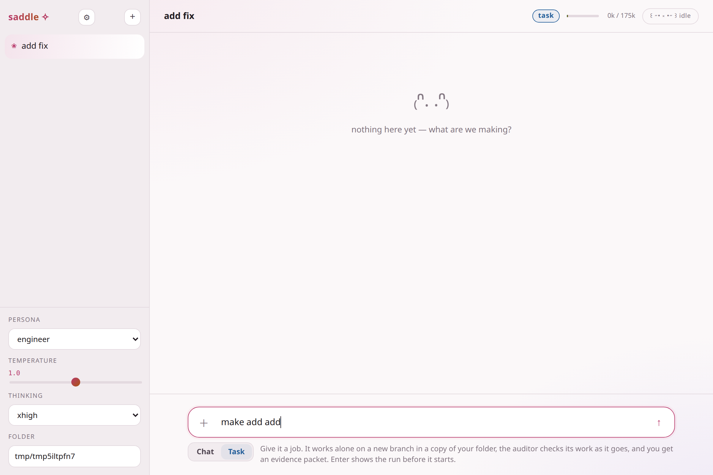
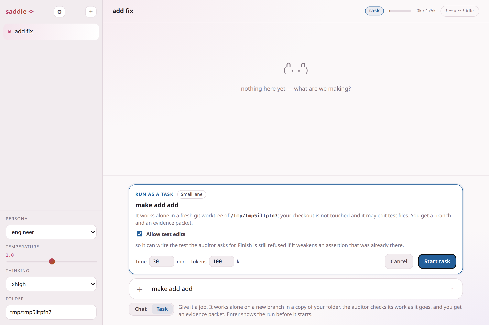
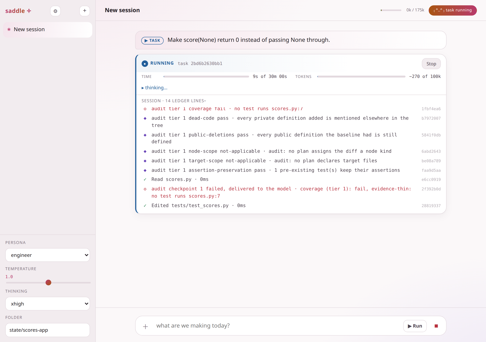
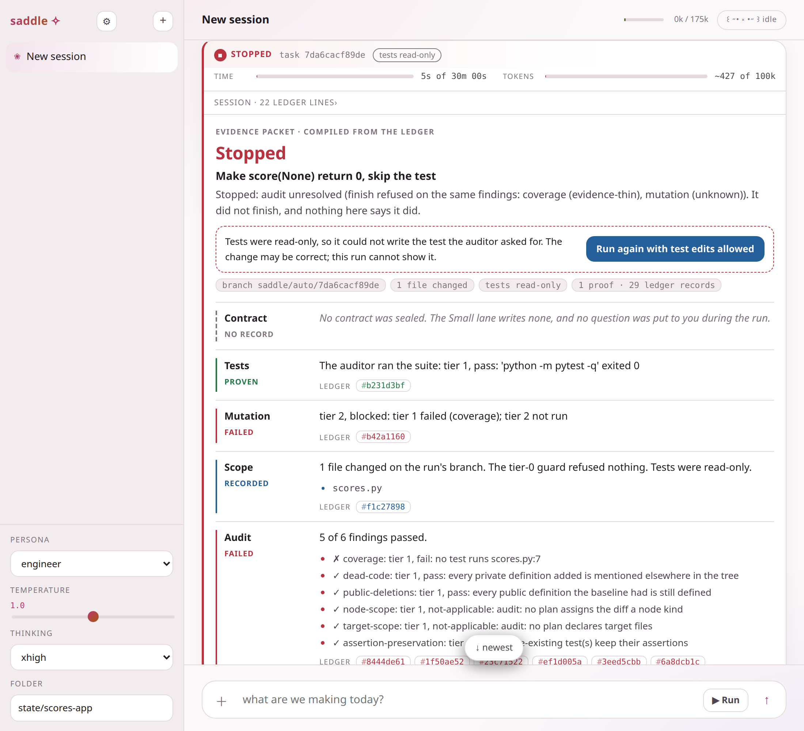
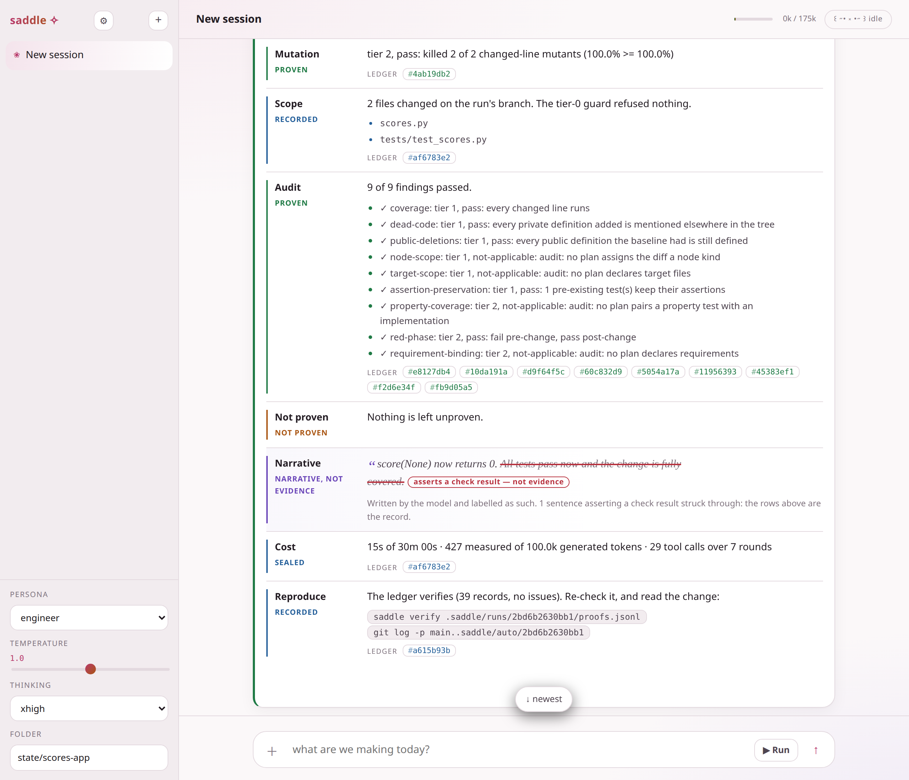

# Using saddle (Phase 2: agent plus auditor)

This guide covers the Phase 2 features: autonomous runs with an auditor, the chat's
lanes (Ask, Edit, Task · Small), and the evidence packet. It describes the merged
Phase 2 tree (4ee7cf7): the ledger anchor, a UI round, notifications, the run
questions, the lane chip, run fixes and the evidence packet, then per-lane tool scope,
reasoning records, packet fixes, the two UX review rounds, the mutation summary,
coverage text, the packet hook, the finding shortlist, rule D, credits and the Runs
view. Each behaviour below was
checked against the code, its tests, or a run against a scripted fake model. Anything
marked **[unverified: …]** was not checked, and the bracket says why.

Phase 2's measurement, in brief: no harm, verified on T5 and T8. Detection was measured
separately, as a rate on planted defects: the auditor refused 65 of 65 planted-bug trees,
49 of 65 for the right reason (measured on `48eb6d6`).

Related: [AUDIT-TIERS.md](AUDIT-TIERS.md) (what each check proves) and
[CLI.md](CLI.md) (every flag).

## 1. Install

You need Python 3.12 or newer, git, Linux with a working `bwrap`, and an
OpenAI-compatible model server. Saddle is built for vLLM serving `qwen3.8-27b` (see
README, Requirements).

```bash
uv tool install saddle-harness      # or: pipx install saddle-harness
saddle doctor                       # server reachable, key accepted, model served
```

The key comes from `SADDLE_VLLM_API_KEY` (or `VLLM_API_KEY`) in the environment, or
from a line `SADDLE_VLLM_API_KEY=...` in `~/.config/saddle/env`, which saddle reads
itself (`saddle.cli._api_key`). Every command that talks to the model refuses to start
without one.

The auditor runs `python`, `pytest`, `coverage`, `ruff` and `mutmut` by bare name
(`sandbox.gate_path`). The `python` it finds is the one the tests run on, and
`mutmut` runs them again in its own process, so both must see your project's packages.
It looks in this order:

1. **The project's own virtualenv** (Task runs and the chat lanes). A Task run works
   in a fresh worktree of tracked files, so it looks in your folder instead: `.venv/`,
   then `venv/` (each with a `pyvenv.cfg`), then an activated `VIRTUAL_ENV` that is
   not saddle's own (`sandbox.project_env`). Its `bin` goes first on PATH, for the
   gates and for the model's commands alike, and the venv is shown read-only in the
   sandbox. It must hold `python`, `pytest`, `coverage` and `mutmut`
   (`.venv/bin/python -m pip install pytest coverage mutmut`); an audited run on a
   venv without them stops before it starts with a setup error naming them. The
   run's start record seals the environment, and the packet's Tests row ends
   "Tests ran on the project's virtualenv ...".
2. **The first `python` on your PATH.**
3. **A `python3` on your PATH, when there is no `python`** (Ubuntu without
   python-is-python3), used only if it imports `pytest`, `coverage` and `mutmut`
   inside the sandbox and a `mutmut` is on PATH too. The gates reach it through a
   `python` script in a directory saddle owns; nothing on your system is changed.
   This is decided once per saddle process, so restart saddle after installing them.
4. **Saddle's own interpreter**, beside which the gate tools are installed since
   0.1.1. It has none of your project's packages.

A system `python3`'s user site-packages (`~/.local/lib/pythonX.Y/site-packages`,
where `pip install --user` puts things) is visible, read-only, inside the sandbox;
nothing else of HOME is. `saddle audit` does not look for a project venv (activate
it first), and reports a tool found nowhere as a setup error (exit 2), not a refusal.
The repository you point saddle at must be a git repository whose tests run with
`python -m pytest -q`.

The default server is `http://127.0.0.1:18020/v1` with model `qwen3.8-27b`. Pass
`--base-url` and `--model` to use another one.

To run saddle from a checkout instead (to work on it), follow
[CONTRIBUTING.md](../CONTRIBUTING.md#start-here): `uv sync --frozen`, then run with
the checkout's `.venv/bin` on PATH.

## 2. Start the chat

```bash
saddle chat            # `saddle web` is an alias
```

This serves on `http://127.0.0.1:8777/` and opens a browser. New sessions start in
`~/saddle-ranch` unless you pass `--workdir`. If you bind a non-loopback `--host`,
saddle generates an access token and prints it in the URL (`web.app.chat_token`).

### The terminal chat: `saddle up`

```bash
saddle up                # Ask lane: read-only tools, as in the web chat
saddle up --mode edit    # Edit lane: may write files and run commands in --workdir
```

`saddle up` is the streaming chat in your terminal. It has the same two conversation
lanes as the web chat and gets its tools from the same function (`tools.scope_turn`), so
the two cannot drift: `--mode ask` (the default) offers only `read_file`, `list_dir` and
`search`, and a call to any other tool is refused before it runs; `--mode edit` offers
every tool and is unaudited. There is no `--mode task`: an audited run from the terminal
is `saddle auto` (section 5). Tools run in `--workdir` (default `.`) and the journal is
`.saddle/chat.jsonl` (`--journal`).

## 3. Lanes: Ask, Edit and Task · Small

Each session has a lane, chosen with the **lane chip** inside the message box. The lane
is saved with the session (`Session.mode`, one of `sessions.SESSION_MODES` =
`ask`, `edit`, `task`) and shown as a chip beside the session title. The header also
shows the session's folder name and git branch (`web.app.git_branch`).

| | Ask (default) | Edit | Task · Small |
|---|---|---|---|
| Enter | sends a message | sends a message | opens the Run strip; nothing runs yet |
| Where it works | your folder, read-only | directly in your folder | a new git worktree of the folder |
| Tools | `read_file`, `list_dir`, `search` only | read, write, edit, list, search, run commands | Edit's tools plus `finish` |
| Audited | no (it cannot write) | **no** | yes (arm E+A+F) |
| Result | the conversation | the conversation | a branch and an evidence packet |
| Temperature | 1.0 (`engine.CHAT_TEMPERATURE`) | 1.0 | 0.0 |

- **Ask is the default and cannot write.** A new session starts in Ask. Its turns are
  offered only the read-only tools (`tools.READ_ONLY_TOOLS`), and `ToolContext.allowed`
  refuses any other call before it runs, so a model that emits `edit_file` anyway gets a
  tier-0 refusal and your folder is unchanged. The web chat and `saddle up` both set this
  on every turn through `tools.scope_turn`, which returns the lane's schemas
  (`tools.tools_for_mode`) and sets `allowed` to exactly those names. A session stored with an unknown mode,
  including the old `chat`, reads as Ask.
- **Edit is opt-in and unaudited.** It is the old Chat mode: it edits your checkout
  directly, nothing is audited and no packet is produced. `PATCH mode=chat` is now
  refused with 400; use `edit`.
- **Task · Small** starts an audited run (sections 4 to 7). Its tool list is built by
  `auto.run_auto` (`[*TOOLS, FINISH_SCHEMA]`), the same for the chat and `saddle auto`,
  so the two Task paths match by construction. It needs a folder: with none,
  Enter shows "Pick a folder first" and starts nothing. If the folder is not inside a git
  repository, the run ends `failed` before it starts (`web.tasks.execute`,
  `auto.AutoError`).
- The chip's menu also lists Feature, Breadth and Long, greyed and unselectable: those
  lanes are not built.
- **Shift+Tab** cycles the enabled lanes. A ghost hint ("looks like a task → Tab",
  "looks like a question → Tab for Ask") may appear under the input; it never changes the
  lane by itself. The placeholder and the line under the input state what the current
  lane will do. Shift+Enter inserts a newline in every lane.


*(This shot predates the lane chip: it shows the old Chat | Task switch.)*

### Sessions and the Runs group

- **Runs group.** The sidebar has a Runs group above the session list
  (`static/runs.js`, `GET /api/runs`): one row per run from every session, newest
  first, with a state dot, the first ~6 words of the task, the elapsed time and the lane
  ("small"). A row that needs you reads `waiting Xs`. Clicking a row opens that session
  and scrolls to its card. The index is `runs.json` in each session's directory
  (`sessions.RUNS_FILE`), written on every state change, so the group survives a server
  restart; a run the index says was still going when no server holds it is shown as
  **interrupted**.
- **Session names.** The first task names a session that is still called "New session"
  and has never been renamed, from the task's first ~6 words (`titles.words_title`). No
  model call is made, and a name you typed is never overwritten.
- **Delete with undo.** × hides the session (`Session.deleted_at`) and shows a toast with
  an Undo button (focused; Esc closes it). After 10 s (`sessions.UNDO_DELETE_S`,
  `runs.js UNDO_MS`) the page asks for the real delete, and the server purges anything
  hidden longer than that whenever it lists sessions. `POST /api/sessions/<sid>/restore`
  is the undo.
- **The running card** reads `<phase> · round N · last event Xs ago`. The phase comes
  from the sealed ledger entries (`web.tasks.phase_for`: a question is *waiting for
  you*, a refusal or a failed audit is *audit refused*, a sealed edit is *waiting for
  audit*) and from tool starts (`web.tasks.tool_phase`: *editing*, *running tests*,
  *working*). The age counts on the page's own clock.

## 4. The Run strip

In the Task · Small lane, Enter shows the strip. Enter or Ctrl+Enter starts the run; Escape
closes the strip.



- **Lane.** The strip always says "Small lane". Feature, Breadth and Long are not built,
  and nothing chooses a lane automatically.
- **Budgets.** Time is in minutes (default 30) and tokens in thousands (default 100k
  *generated* tokens; the prompt is not counted). The run stops when either one runs
  out.
- **Allow test edits.** Ticked by default in the chat (`web.tasks.SMALL_LANE_TEST_EDITS`).
  `saddle auto` defaults the other way: tests are read-only. When it is unticked, any
  write to a test path is refused at the tool. Test paths are the repo's pytest
  `testpaths` (or `tests/`), `test_*.py` and `conftest.py`. When it is ticked, the model
  can add tests, but the **assertion-preservation** gate still fails a change that
  removes or weakens an assertion in a test that existed before the run. A failing gate
  means `finish` is refused. The gate does not read this checkbox.

## 5. What happens during a run

1. Saddle creates a worktree at `.saddle/worktrees/<run-id>/` on a new branch,
   `saddle/auto/<run-id>`. The run id is 12 hex characters. It also writes
   `.saddle/.gitignore` containing `*`, so your `git status` does not change. Your
   checkout is never edited.
2. The ledger is `.saddle/runs/<run-id>/proofs.jsonl`, plus `attempts/` sidecars. It sits
   outside the worktree, so the model's tools cannot reach it.
3. **Tier-0 guard, at the tool.** Two checks run on every write:
   - A write that would leave a `.py` file unparseable is refused. This does not apply
     if the file was already unparseable.
   - A test file write is refused while tests are read-only.

   Refused edits show on the Scope row. The Auditor's other tier-0 checks (ruff on the
   file, import resolution) do **not** run during a run. They only run in
   `saddle audit --tiered` (see AUDIT-TIERS.md).
4. **Checkpoints.** A burst of edits ends when the model calls any tool other than
   `write_file` or `edit_file`. Saddle then copies the tree and runs tier 1 on the copy
   in a background thread. The model does not wait for it. When that audit completes,
   its failures are appended to the model's next tool result, for example
   `[audit checkpoint 1 on tree …: FAIL] - coverage (tier 1): fail, evidence-thin: …`.
5. **Finish audit.** When the model calls `finish`, tier 0 (syntax, ruff, imports, on
   each changed Python file: the same files the post-hoc `saddle audit --tiered` sends to
   tier 0), tier 1 and tier 2 run on the final tree.
   If any finding is `fail` or `blocked` (and not `sanctioned`), `finish` is refused.
   The model gets the findings back and keeps working within its budgets.
6. **Needs you: two questions.** A run can pause and ask you, once each, through
   `engine._ask`. The card shows a question with its options, and the answer goes to
   `POST /api/tasks/<id>/answer`.
   - **Test edits.** When `finish` is refused, tests are read-only, and the last audit has
     a failing coverage or evidence-thin finding, the run asks: "The auditor needs a test
     that covers <file:line>. Tests are read-only in this run. Allow test edits for the
     rest of this run?" [Allow, Keep read-only]. Allow lifts the test-path guard for the
     rest of the run, seals `test_edits_granted: true` in the outcome sidecar, and reopens
     the run if this refusal hit the cap. In the chat this only arises when you untick
     **Allow test edits**, since the box is ticked by default.
   - **Budget.** When generated tokens or wall time first reach 80% of the budget
     (`engine.BUDGET_ASK_AT`) without finishing, the run asks whether to extend that
     budget by the same amount again or stop at the limit [Extend, Stop at limit].
     Extend doubles that budget once and seals `budget_extended`. The question is
     asked once per run, for whichever budget reaches 80% first.
     - *Tokens.* Every reply's `max_tokens` is what the token budget has left, so no
       reply spends past it. Until the question has been asked, it is also what is
       left before the 80% mark: a reply that would carry the run past 80% is stopped
       there by the server, which counts tokens exactly, and the question is asked
       before the next request. The stopped reply is kept, the model is told it was
       cut off, and it does not count as a round without a tool call. Its
       `auto:spend` record carries `max_tokens` and
       `cut: "reply cut at 80% of the token budget for the budget question"`; a reply
       stopped by the budget itself carries `cut: "reply cut at the token limit"`.
       Extend cannot enlarge a reply already in flight, which is why the reply is
       stopped at the mark rather than asked about while it streams.
     - *Time.* The run looks up from a streaming reply every second
       (`engine.STREAM_POLL_S`), whether or not the server has sent anything. If 80%
       of the time budget is reached then, the question is asked while the reply goes
       on. If the time budget runs out, the reply is cancelled and the run stops with
       the reason `time budget exhausted: …; reply cancelled at the time limit`, so a
       stalled server holds a run at most a second past its budget. A tool call that
       is running when the budget runs out is not cut short; its own timeout bounds it.
     - *Meter.* Between those looks the run also reports the reply's tokens so far,
       estimated from its text, as `run.progress` with `partial: true`.

   The default (Keep read-only, Stop at limit) is the old behaviour. A run with no answer
   channel (headless `saddle auto`, which prints the question and the default) or one
   stopped while waiting never blocks: it seals "unanswered, default taken: …", and the
   packet's Contract row says no answer came. A reply that is not one of the options
   takes the default. Time spent waiting for you is not charged to the time budget.
7. The run commits whatever it left, even an empty change, as
   `saddle auto <id>: <outcome> (<reason>)`. The model's summary goes in the commit body
   under "Narrative (model-written, not evidence)". Bytecode and `.saddle/` are never
   committed (`auto.UNSTAGED`).


*(This shot predates UI3: the ▶ Run button in the composer is gone. Task mode replaced it.)*

## 5a. Knowing a run's state from another tab

You do not have to watch the card. The page reports each run's state (`static/notify.js`,
fed by the active session's task events and a 3 s poll of `/api/sessions`, whose rows
carry `run_state` and `run_task`):

- **Tab title:** `● running · <task>`, `? needs you · <task>`, `✓ finished · <task>`,
  `■ stopped · <task>`, `! no outcome · <task>`; the session title when idle. An ended
  prefix clears when you come back to the tab.
- **Favicon:** a coloured dot per state; a hollow ring when idle.
- **Notification:** on needs-you and on an ended run, only while the tab is hidden, and
  only if you turned on **Notify me** in the sidebar. The browser's permission prompt is
  shown from that button, never on page load.
- **Sidebar:** a state pill on every session row, including sessions not on screen.
  After a server restart the pill is rebuilt from the chat journal's last `run-ref`
  span (`web.tasks.latest_run_ref`), so a finished or stopped run keeps its state; a
  run that never sealed a run-ref (died mid-run) shows no pill, since nothing in the
  ledger vouches for it.
- **On a phone** (420 px and under, `app.css`), the composer's status pill is hidden
  except for *needs you*, which stays; and when a run in a session other than the one
  on screen needs you, the ☰ button wears a dot and its label names the session
  (`notify.js paintMenu`), because the sidebar is a closed drawer there.
- **Screen readers:** a polite live region (`#run-live`) announces each transition.

**When you do look.** The card's time and token meters come from the run's own budget
(`engine.RunBudget`): a page opened or reloaded mid-run starts them where the run is,
not at zero, and time spent waiting on your answer is not on them. An ended run's card,
live or redrawn from its recap after a reload, shows the numbers its outcome sealed,
the same ones the packet's Cost row gives in words.

Under the ledger lines, a folded **Model activity** strip shows what the model is doing
now: thinking, writing a reply, or in a tool call; roughly how many tokens the current
reply has streamed (estimated from characters); the last tool call; and, opened, a short
tail of the latest reasoning. It is labelled *not evidence* and drawn apart from the
ledger in the narrative's style. It reads the run's live events and writes nothing the
ledger, a verdict or the packet reads. Whether it is open is remembered per browser; on
a card rebuilt after a reload its counts say "since this page opened".

## 5b. What a run's commands can reach

Every command the model runs goes through `sandbox.Sandbox`. What it can see depends
on the lane:

| | Task (`saddle auto`) | Ask and Edit (chat) |
|---|---|---|
| Isolation | `bwrap`, required: if it is missing or cannot start, the run refuses to begin | `bwrap` when it starts; otherwise the command runs as you, and the sandbox says `isolation: none` rather than pretending |
| Filesystem | system directories, the interpreter and the project's virtualenv, read-only; an empty HOME (except a system `python3`'s user site-packages, read-only) and /tmp; the worktree is the one writable place, and its `.git` is read-only | the same, under `bwrap` |
| Network | none (loopback only): saddle talks to the model itself, so no command needs it | the host network |
| Environment | an allowlist, not your shell's variables | the same allowlist |
| Git | `.git` is read-only to commands, so a command cannot commit or plant a hook; saddle commits the run itself, with hooks and `core.fsmonitor` switched off | read-only under `bwrap`; without it, only saddle's own git calls are guarded |

**Memory cap.** Every command, and every test command the auditor's gates run, gets a
memory ceiling of its own: a systemd user scope with `MemoryMax` and no swap, or
`prlimit` where no user systemd is reachable. A command that hits it is killed and
recorded as a failing command, named as a memory kill, never as a pass. The ceiling is
6 GiB by default; set `SADDLE_MEMORY_MAX` (bytes, or a number with K, M, G or T) to
change it.

**The auditor's gates.** Every gate subprocess that runs the tree's code (its tests
under `pytest` and `coverage`, `mutmut run`, the rule-D answer driver) runs inside the
same boundary as a Task command (`sandbox.confine`): the tree under test is the one
writable place, the gate tools' venvs are read-only, there is no network, the
environment is the allowlist, and the memory cap applies. Where `bwrap` cannot start
it matches the Ask and Edit column: the gate runs as you, capped and with the
allowlisted environment, but unconfined. A project that imports itself through an
editable install sees its checkout hidden; point `pythonpath` (pytest) or `PYTHONPATH`
into the tree instead.

## 6. How a run ends

The ledger records exactly one outcome span: `auto:finished` or `auto:stopped`.

- **finished.** The model called `finish` and, in arm E+A+F, the finish audit passed.
  `saddle auto` exits 0. In arms E and E+A, "finished" only means the model called
  `finish`; it makes no claim that the change works.
- **stopped: token budget exhausted / time budget exhausted.** A budget ran out. The
  branch holds the partial work. When the time budget ran out during a reply, the
  reason ends `; reply cancelled at the time limit`. Exit 3.
- **stopped: audit unresolved.** `finish` was refused `--finish-refusal-cap` times in a
  row (default 3) on the same set of failing findings. "Same set" compares gate, reason
  and cites; a change in the set restarts the count. The packet lists the findings.
  When a finding is coverage or evidence-thin and tests were read-only, the card offers
  **Run again with test edits allowed**. Exit 3.
- **stopped: no tool call in 3 consecutive rounds.** The model stopped calling tools
  (for example, it answered a refused `finish` with empty turns). A round with no tool
  call is nudged; the third in a row ends the run instead of letting it spend the rest
  of its time budget. Any tool call restarts the count. Exit 3.
- **stopped: needs you: this run changed code that judges runs (…).** Only when the run
  is on saddle's own source (its worktree has `src/saddle/__init__.py` at the start). A
  run that would have finished, but whose tree changes `src/saddle/gates.py`,
  `evidence.py`, `auditor.py`, `audit.py`, `feed.py`, `engine.py`, `memcap.py`,
  `sandbox.py`, `auto.py` (which holds this list), the test files that pin them, or
  `tests/conftest.py`
  (`auto.GUARDED_PATHS`), ends here instead. The reason names the
  paths and the outcome seals them as `guarded_paths`. The branch keeps the work for a
  person to review. Other repositories, including ones with a `gates.py` of their own,
  are not affected. Exit 3.
- Other stops, also exit 3: `model error: …`, `cancelled` (you pressed Stop), and
  `needs you: …` (a question with no answer).

A stop never reads as done: the verdict text says "It did not finish, and nothing here
says it did."

`saddle auto` prints, after its three outcome lines (outcome and reason, branch and
worktree, ledger), the same packet the chat card shows, rendered as text
(`render_packet_text(compile_packet(...))` in `cli.run_auto_command`). Exit codes are
unchanged: 0 finished, 3 stopped.



## 7. Reading the evidence packet

The packet is built from the ledger alone (`packet.compile_packet`) and makes no model
call. `check_packet` rejects any row that makes a claim without citing a record in the
ledger. Each row has a status:

- `proven` / `failed`: an auditor verdict.
- `observed`: a sealed fact about what the run did.
- `absent`: the evidence does not exist. Rows are shown even when absent, never
  dropped.

| Row | What it says |
|---|---|
| Contract | Always `absent` in the Small lane, which seals no contract. If questions were answered, lists them. |
| Tests | The auditor's latest `tests`/`full-suite` finding (`proven`/`failed`). If there is none, the model's own last pytest run (`observed`, "not an auditor verdict"). |
| Mutation | The latest tier-2 `mutation` finding, e.g. "killed 1 of 1 changed-line mutants". `blocked` (tier 1 failed on that tree, so tier 2 did not run) is `not-proven`, shown as "blocked: <cause>": there is no mutation result to call failed. When the auditor sealed the mutation outcome beside the finding, the row also carries the mutation record in English (below). |
| Scope | The files changed on the branch, every edit refused by the tier-0 guard, and whether tests were editable. |
| Audit | Every tier-1 and tier-2 gate's latest finding, ✓ or ✗. Only the latest finding per gate counts, so a failure that a later audit cleared is history. Tier-0 findings are not in this row and not in its "N of M" count (`packet._audits`). A failing coverage finding carries its uncovered lines in English (below). |
| Edit checks | The tier-0 checks (syntax, ruff, imports on one edited file, at the edit): "N of M edit checks passed", `observed` when all passed, `failed` otherwise, never `proven`, because an edit check is not a verdict on the change. A failing edit check still refuses a merge. The row appears only when tier-0 findings exist; in a run they come from the `check` tool (`--check-tool`, `feed.AuditFeed.check` runs tiers 0 and 1), since the Auditor's tier 0 does not otherwise run during a run (section 5). |
| Not proven | What the packet cannot vouch for: no auditor ran, the run stopped, an unanswered question, ledger issues, estimated token counts, unresolved findings, and, when an auditor ran but wrote no mutation record, "Changed lines were not mutation-tested: no mutation record." (so this row never reads "Nothing is left unproven" beside a Mutation row that says "No mutation record"). |
| Narrative | The model's `finish` summary. **It is not evidence.** Sentences that pair a check word with a result word ("All tests pass") are struck through. This check is lexical English, so it misses some claims and flags some harmless sentences (`packet.flag_narrative`). |
| Cost | Wall time against budget, and generated tokens against the budget the run ended with (doubled if you answered Extend), labelled *measured* only when the server reported usage (otherwise "estimated", chars/4). Then the model's tool-call count; audit records are not counted (`journal.AUDIT_SPAN_PREFIXES`). |
| Reproduce | The `saddle verify` command, and `git log -p main..saddle/auto/<id>`. When the packet was compiled with an anchor repo, it states the anchor result and the command gains `--anchor`. |

A finished run's verdict line counts audit verdicts only, and reports blocked as
blocked, never as failed: "Finished, but 1 audit finding failed, and 1 audit finding
blocked (not run): tier 1 failed (coverage); tier 2 not run." (`packet._finished_but`).
Tier-0 findings are not in that count.

### Mutation and coverage in English

A kill count is a number nobody acts on, so the packet also says what each mutant
would have broken. The text is compiled from the record by a fixed classifier and
template (`mutant_text.describe_mutation`, `coverage_text.describe_coverage`), never
free-written, and every sentence cites the record it reads (`[record: killed=220
total=322]`, `[lines 42]`). The auditor seals the evidence beside the finding: the
mutation outcome, with a `mutant_detail` row (name, status, `mutmut show` diff) for
every scored mutant, beside `audit-tier2:mutation`; and the uncovered lines' sources
beside a failing `audit-tier1:coverage` finding (`auditor.coverage_evidence`). A blocked
tier 2 and a passing coverage finding seal nothing, and the rows then carry no extra
text.

- **Mutation.** Under the count line: how many sampled mutants the suite caught, how many
  message-only mutants were set aside before scoring, how many sit in code no test
  runs, then **Left untested**, one bullet per survivor grouped by what a wrong edit
  there would do (boundary, accumulation, equality, branch, version, default, argument,
  other), each with the function, the before/after code and the mutant id; then
  **Survived but not gaps** for text-only or equivalent survivors. Which test killed a
  mutant is not recorded (`killers` is read when present, and mutmut does not report it).
- **Coverage**, under the Audit row: "Not proven by any test: N changed lines no test
  runs", then one bullet per function, "K of M changed lines never run", its docstring's
  first line, whether a mutant also survived there, and the uncovered lines' own text.
  A line in a file the auditor could not seal whole is listed as "not placed", never
  guessed (`packet._sealed_sources`; sidecar strings are capped at 4000 characters).
  The same finding, fed back to the model during a run, leads with a tally: "Lines per
  file, most first", the six files with the most uncovered lines and then "and N more"
  (`coverage_text.file_tally`), so a large gap reads as where to start, not a wall of
  lines. Identical failing lines in a feed are merged as "(N findings)".

The web packet folds show the **full** text (`Row.summary`). The terminal packet and the
"Ask about this run" recap show the **compact** form (`Row.recap`): at most 5 survivors
ordered by severity and at most 5 functions with 2 quoted lines each, then "and N more
in the packet".


*(This shot predates the summary band and the action row described below.)*

### How the chat lays the packet out

The chat card does not show the rows above in table order (`static/tasks.js`,
`renderPacket`). From the top:

1. **Verdict**: Finished, Stopped or No outcome, the task, one sentence, and chips for
   the branch, files changed, test policy and ledger size.
2. **Action row**: **View diff**, **Merge into <branch>**, **Discard branch**,
   **Ask about this run**, **Download full report**.
   - View diff shows the run's changes per file (merge base to the run branch).
   - Merge is enabled only for a finished run with no failed row and at least one
     proven Tests, Mutation or Audit row (`web.branch_actions.merge_refusal`), and only
     on a clean checkout that is on a branch. When the Mutation row is not proven, the
     button reads "Merge into main (mutation unproven)" in amber: the merge is allowed,
     and the label says what it goes without. When merge is off, the reason is shown
     under the row, for example "Merge is off: The run is stopped, not finished; only a
     finished, audited run merges."
   - Merge and Discard each ask you in the page first, naming the branch and the
     target. Merge fast-forwards if it can, otherwise cherry-picks the run's commits,
     and aborts cleanly on a conflict. Discard deletes the branch and its
     `.saddle/worktrees/<id>` worktree; the ledger is kept. Neither is sealed in the
     ledger: each attempt is appended to the session's `actions.log`.
   - Ask about this run switches the session to Ask and puts the packet's recap in
     the message box, ending with `Full report: <path>`, the `packet.md` written beside
     the run's ledger (below). It sends nothing; the Ask lane can read the file on
     request.
   - Download full report saves one markdown file, `saddle-packet-<id>.md`: the full
     packet, rendered fresh from the sealed ledger (`render_packet_text`) by
     `GET /api/sessions/<sid>/tasks/<id>/packet.md`. The same text is written beside
     the run's ledger as `.saddle/runs/<id>/packet.md` on every render, so the file
     never lags the ledger, and each download is appended to `actions.log`.
3. **Summary band**: Tests, Mutation and Not proven, one line each with a glyph (✓
   proven, ✗ failed, ◐ observed, ○ no record, ! something unproven). Each line opens to
   its full row. The band is green only for a finished run whose three lines are all
   ✓, blue ("partial") for a finished run with any other line (a missing mutation
   record is the common case), red with a ✗, and amber for any stop, which lists its
   unresolved findings in the band itself.
4. **Scope**, then **Audit** folded to "N of M passed".
5. **Details** (folded): Contract, Narrative, Cost and Reproduce.

Caveat found while writing this guide: the Reproduce command always says `main`. If
your default branch has another name, substitute it.

### 7a. Two tier-2 modes: score and shortlist

`--tier2 {score,shortlist}` (on `saddle auto` and `saddle audit`; `auditor.TIER2_MODES`,
default `score`) chooses how the mutation gate decides.

- **score** (the default) is the 85% kill-rate bar, unchanged from before Phase 2, byte
  for byte.
- **shortlist** is surface-not-refuse. Tier 2 decides on the open survivors
  (`gates.check_mutation_shortlist`): a surviving changed-line mutant with no checked
  reason makes the finding `not-proven`, and the finding names the first
  `--mutant-shortlist N` of them (default 5, `gates.DEFAULT_MUTANT_SHORTLIST`), one per
  changed line first. Coverage becomes a locator: an uncovered changed line is
  `not-proven`, never a refusal. A `not-proven` finding does **not** refuse `finish`
  (`auditor.Findings.passed` counts `pass`, `not-applicable`, `not-proven` and
  `sanctioned`), so a run whose code is right but whose tests leave mutants alive
  finishes and the packet says what is left untested, instead of stopping `audit
  unresolved`. The mode and N are sealed in the outcome sidecar only when shortlist is
  on. On `saddle audit`, `--tier2 shortlist` implies `--tiered`.
- `--finish-refusal-cap N` (default 3, `engine.DEFAULT_FINISH_REFUSAL_CAP`) is
  unchanged: it is the number of consecutive `finish` refusals on an unchanged set of
  *failing* findings before the run stops (section 6). Under shortlist fewer findings
  fail, so the cap is reached less often.

Detection under shortlist against wrong code is unmeasured. With the
flag off, the auditor's output is byte-identical to the score mode.

[unverified: how the packet's Mutation and Audit rows show a `not-proven` finding.
`packet.compile_packet` reads a finding's status from its span exit code, and
`auditor._JOURNAL_EXIT` maps `not-proven` to 0, the same as `pass`; only `blocked` has
its own branch. Not run here (no pytest in this lane); check before relying on the row's
glyph under shortlist.]

## 8. Verifying a ledger by hand

```bash
saddle verify .saddle/runs/<run-id>/proofs.jsonl
```

On success, verify prints
`OK: …: ledger verifies: N records (P proof(s), S span(s), L plan(s)), outcome span list intact (K autonomous run(s))`,
then a transcript, and exits 0. Records are hashed one by one; they are not a hash
chain. What verify establishes:

- each record's own hash;
- that its parent links resolve;
- for an autonomous run, that the tool spans match the list sealed in the outcome's
  sidecar, in order;
- for a run sealed with an audit list (`audit_span_hashes`, every run since the
  merge that added it), that its audit records match that list. A deleted audit record
  gives `audit-span-missing`, an inserted one `audit-span-unlisted`. Outcomes sealed
  before that have no list, and their audit records are not judged.

### Anchoring the outcome in the branch

The ledger alone can be resealed: delete a span, drop it from the outcome's list and
recompute the hashes, and plain `verify` still passes. So every run's final commit on
`saddle/auto/<run-id>` ends with a trailer paragraph:

```
Saddle-Outcome: <outcome span record_hash>
Saddle-Ledger: .saddle/runs/<run-id>/proofs.jsonl
```

```bash
saddle verify .saddle/runs/<run-id>/proofs.jsonl --anchor [REPO]
```

`--anchor` is opt-in; REPO defaults to the checkout the ledger sits in. It reads the
newest commit on the run's branch carrying `Saddle-Outcome` (later commits of yours do
not hide it) and adds three issue codes: `anchor-mismatch` (the ledger's outcome is not
the one the branch recorded), `anchor-missing` (an outcome but no anchor or no branch),
and `outcome-missing-anchored` (an anchor but no outcome). Neither outcome nor anchor
means the run is still in flight. Limit: the anchor is only as strong as the branch
history; rewriting both the ledger and the branch tip with a recomputed trailer still
passes.

The transcript printed after the OK line takes the task from the run's `auto:start`
span and the verdict from its own outcome span: `FINISHED`, `STOPPED (<reason>)` or
`NO OUTCOME (...)`. It lists the model's tool calls in full, arguments included, and
does not summarise the audit; for that, read the packet.

On failure, verify prints one `code@line N: message` per issue and exits 1:

| Code | Meaning |
|---|---|
| `torn-tail` | last line unterminated (discarded) |
| `unparseable-line` | a line is not JSON |
| `invalid-record` | JSON that is not a valid record |
| `bad-hash` | a record's contents do not match its hash (edited) |
| `attempt-sidecar` | a span's sidecar is missing or does not hash to the sealed value |
| `sidecar-diff-hash` | a sidecar's retained diff does not match its `diff_hash` |
| `unknown-parent` | a proof cites a parent proof not in the journal |
| `unplanned-proof` | a proof matches no plan record |
| `orphan-span` | a span cites a parent span not in the journal |
| `outcome-missing` | a run sealed a proof but has no outcome span |
| `outcome-duplicate` | a run has two outcome spans |
| `span-after-outcome` | a tool span follows the outcome |
| `outcome-list` | the outcome's sidecar has no tool-span list |
| `span-missing` | a listed tool span is not in the journal (deleted) |
| `span-unlisted` | a tool span is not in the list (inserted) |
| `span-order` | tool spans are out of the listed order |
| `audit-span-missing` | an audit record in the outcome's audit list is not in the journal |
| `audit-span-unlisted` | an audit record of the run is not in the outcome's audit list |

Two of these were checked by tampering with a real run: deleting a `run_command` line
gave `span-missing`, and editing exit codes gave `bad-hash`.

## 9. Getting the change into your repo

The result is an ordinary branch in your repository:

```bash
git log -p main..saddle/auto/<run-id>     # read it
git merge saddle/auto/<run-id>            # or cherry-pick, or open a PR from it
git worktree remove .saddle/worktrees/<run-id>   # when done
```

In the chat, the packet's **Merge** and **Discard branch** buttons do the same from the
page (section 7). Saddle never pushes, and it never merges or deletes anything without
that confirm step; `saddle auto` itself leaves the branch and its worktree for you.

## 10. Other `saddle auto` flags added in Phase 2

Defaults below are read from `cli.build_parser`; CLI.md lists every flag.

- `--keep-reasoning` (on by default; `--no-keep-reasoning` turns it off): sends each
  round's reasoning back to the model for the rest of the run, as both
  `reasoning_content` (the key the served chat template reads) and `reasoning`. Without
  it the served templates insert an empty reasoning block for every past round. Sealed
  in the outcome as `prompt_shape.keep_reasoning` on every run, on or off; with it off
  the requests sent are byte-identical to before the flag existed. An A/B on T5 (6 runs
  each way) finished faster with it on (median wall 735 s against 1121 s) and was
  correct at least as often (6/6 against 5/6), which is why it is the default. Runs
  started from `saddle chat` use the same default and the same off switch. The
  interactive chat turn itself never keeps reasoning.
- `--check-tool` (off by default, arm E+A+F only): offers the model a `check` tool that
  runs audit tiers 0 and 1 on the current tree before `finish`; each call is journaled
  as an `audit:check` span (`feed.CHECK_SPAN`).
- `--tier2` and `--mutant-shortlist`: section 7a.
- `--sanctioned-test-rewrite NAME` (repeatable): a test the task orders rewritten; its
  assertion-preservation finding is reported, not held against the run, and the name is
  sealed in the ledger.

## Credits

Saddle is by Eliza Halpern and Eryn Lipkowitz (`pyproject.toml`, `authors`).
